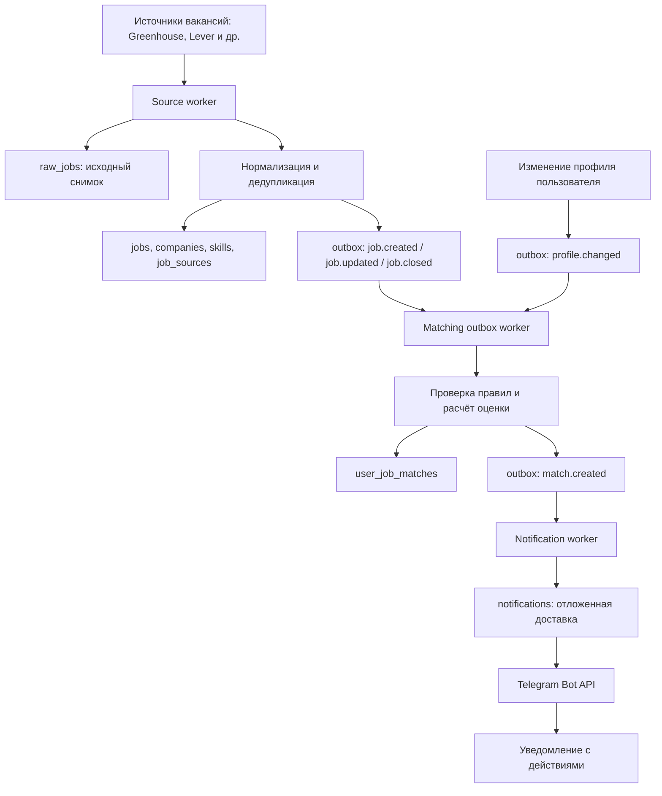

# Как работает backend-пайплайн HireRadar

Документ описывает путь вакансии от подключённого источника до Telegram-уведомления. Очереди и состояние хранятся в PostgreSQL, поэтому обработку продолжают воркеры после перезапуска приложения.

## Схема потока

## 1. Получение вакансий

Source worker выбирает включённые источники, у которых наступил `next_sync_at`. Выборка блокируется через `FOR UPDATE SKIP LOCKED`: если запущено несколько экземпляров backend, одну запись источника не заберут одновременно. За один проход воркер берёт не больше своего лимита параллельности (от 1 до 32) и опрашивает источники параллельно. Между пустыми проходами он ждёт две секунды.

Для каждого источника создаётся запись `source_sync_runs` со статусом `running`. Адаптер источника загружает вакансии; на запрос установлен тайм-аут две минуты, а ответ ограничен 50 000 вакансий. Курсор следующей страницы/синхронизации сохраняется для следующего запуска.

## 2. Сохранение и очистка вакансий

Успешный результат обрабатывается одной PostgreSQL-транзакцией:

1. Исходное содержимое вакансии записывается в `raw_jobs` с SHA-256-хэшем. Повторный идентичный снимок не создаёт дубликат.
2. Вакансия нормализуется: очищаются поля, нормализуются компания и название, извлекаются навыки из справочника навыков и их синонимов.
3. Дубликаты ищутся по внешней ссылке после каноникализации URL и по отпечатку «компания + нормализованная должность + локация». Связь внешнего ID источника с общей вакансией хранится в `job_sources`.
4. Новые и изменённые вакансии публикуют `job.created` или `job.updated` в `outbox_events` в той же транзакции, что и сама вакансия.
5. Отсутствующая вакансия сначала помечается пропущенной. Связь с источником деактивируется после двух последовательных успешных прогонов с отсутствием вакансии; общая вакансия закрывается, только если активных источников для неё больше нет. Закрытие публикует `job.closed`.
6. Сохраняются курсор источника и успешная статистика `source_sync_runs`.

Если загрузка или сохранение завершилось ошибкой, запуск помечается как `failed`, а повтор планируется через минуту. Транзакция сохранения откатывается целиком, чтобы частично обработанный прогон не закрыл вакансии, которые ещё не успел увидеть.

## 3. Пересчёт совпадений

Изменения вакансий и профилей пользователя попадают в `outbox_events`. Matching worker забирает готовое событие через `FOR UPDATE SKIP LOCKED` и вызывает пересчёт:

- `profile.changed` пересчитывает вакансии для одного кандидата;
- события вакансии пересчитывают её для пользователей с кандидатскими данными.

Сначала применяются жёсткие ограничения: статус вакансии, страна/допуск, разрешённые регионы, формат работы, тип занятости, минимальная зарплата и максимальный возраст вакансии. Для подходящих вакансий считается оценка по навыкам (40%), должности (25%), уровню (15%), локации (10%) и зарплате (10%). Допустимые пользовательские веса могут заменить значения по умолчанию. Неизвестные данные дают нейтральную оценку; если результат ниже минимального порога пользователя, совпадение не считается подходящим.

Совпадения сохраняются в `user_job_matches`; событие `match.created` записывается в outbox в рамках сохранения. Пересчёт допускает повторный запуск: повторная обработка обновляет те же данные. Ошибка обработки увеличивает счётчик попыток и откладывает событие по экспоненциальной задержке, максимум до часа.

## 4. Постановка и отправка уведомления

Notification worker читает `match.created` и сверяет настройки пользователя. Уведомление планируется, если уведомления включены, оценка не ниже пользовательского минимума, Telegram подключён и вакансия не скрыта, не отмечена как неподходящая или уже применённая.

В `notifications` создаётся уникальная запись на пользователя, вакансию и тип уведомления. Время отправки учитывает тихие часы и дайджест. Перед фактической отправкой воркер повторно проверяет настройки, активность вакансии и минимальную оценку. Суточный лимит считается в часовом поясе пользователя; превышение переносит отправку на следующий местный день.

Telegram-сообщение содержит оценку совпадения, должность, компанию, доступные сведения о локации/зарплате/типе занятости и навыки. Кнопки позволяют открыть вакансию, сохранить её, скрыть или отметить как уже рассмотренную.

## 5. Повторы и восстановление после перезапуска

- Запланированные источники определяются по `sources.next_sync_at`.
- Неподтверждённые события остаются в `outbox_events` (`processed_at IS NULL`); `available_at` задаёт время следующей попытки.
- Обработчики блокируют записи на время обработки, а повторный пересчёт вакансий/совпадений идемпотентен.
- Отложенные уведомления остаются в таблице `notifications`, и новый экземпляр воркера может продолжить отправку.
- Ошибки обработки match-событий повторяются с экспоненциальной задержкой до одного часа. Для доставки уведомления также применяется экспоненциальная задержка; после 12 неудачных попыток запись получает статус `failed`.

Запись `sent` фиксируется после успешного ответа Telegram. Если процесс завершится после принятия сообщения Telegram, но до фиксации `sent` в PostgreSQL, повторная отправка теоретически возможна: у внешнего Telegram API нет общей транзакции с базой. Поэтому гарантия «одна доставка» не распространяется на такой сетевой сбой.

## Основные таблицы

| Таблица | Назначение |
| --- | --- |
| `sources`, `source_sync_runs` | Настройки расписания источника и история прогонов |
| `raw_jobs` | Исходные снимки вакансий и хэш содержимого |
| `companies`, `jobs`, `job_sources`, `job_skills` | Нормализованные компании, вакансии и связи с источниками/навыками |
| `outbox_events` | Надёжная передача событий между этапами пайплайна |
| `user_job_matches` | Оценка и объяснение совпадения вакансии с кандидатом |
| `notifications` | Планирование, состояние, число попыток и ошибки доставки |
| `telegram_accounts` | Привязка аккаунта пользователя и чата Telegram |

## Проверка полного пути

Интеграционный тест `TestSeededSourcePipelineSurvivesWorkerRestartAndDeliversOnce` проходит основные границы пайплайна на PostgreSQL: сохраняет исходный снимок и вакансию, обрабатывает событие совпадения, ставит уведомление в очередь, создаёт новый экземпляр воркера и проверяет завершённую доставку. Для запуска теста нужен мигрированный PostgreSQL и `TEST_DATABASE_URL`.

## Управление и отладка служб

В Docker-контейнере запущен один backend-процесс. Он поднимает пять служб в отдельных горутинах: `source`, `matching`, `notification`, `email` и `resume`. Службы с отсутствующими настройками отображаются как `disabled` с причиной; например, без `TELEGRAM_BOT_TOKEN` не запускается доставка в Telegram. Остановка контейнера отменяет общий контекст: backend ждёт завершения служб, затем останавливает HTTP-сервер.

Операторские маршруты защищены заголовком `X-Operator-Token` (значение `OPERATOR_API_TOKEN` в окружении). В production Compose токен обязателен; в локальном `.env` его можно создать командой `openssl rand -hex 32`.

- `GET /api/v1/admin/services` возвращает имя, состояние, активность, причину отключения, время последнего запуска, последнюю ошибку и число запусков каждой службы.
- `POST /api/v1/admin/services/{name}` принимает `{"action":"start"}`, `{"action":"stop"}` или `{"action":"restart"}`. Для старта после `failed` используйте `restart` или `start`.
- Состояния: `starting`, `running`, `stopping`, `stopped`, `failed`, `disabled`. Неожиданный выход и panic отражаются как `failed`; автоматического бесконечного перезапуска нет, чтобы ошибка зависимости не скрывалась crash-loop циклом.
- `docker compose logs -f api` показывает JSON-логи всех служб и API. Поля `service` и `error` позволяют фильтровать сбойный воркер; HTTP-логи дополнительно содержат request ID и trace ID. `/metrics` содержит HTTP-метрики процесса.

Проверка статуса и команды управления доступны только при настроенном операторском токене. Число запусков и ошибки в статусе сбрасываются при перезапуске backend; сами задания и повторы остаются в PostgreSQL.
