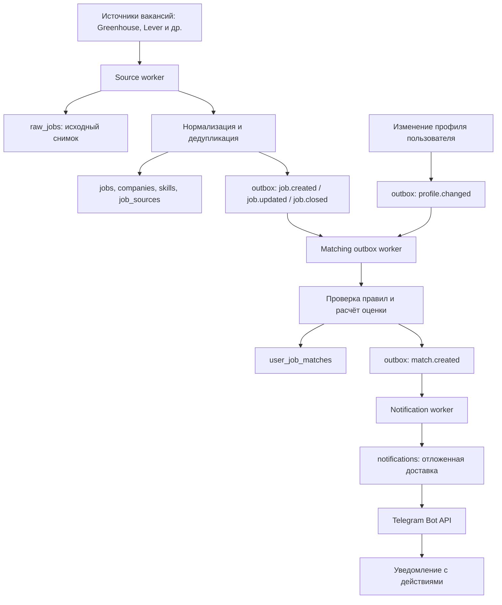

# Как работает backend-пайплайн HireRadar

Документ описывает путь вакансии от подключённого источника до Telegram-уведомления. Очереди и состояние хранятся в PostgreSQL, поэтому обработку продолжают воркеры после перезапуска приложения.

## Схема потока

```mermaid
flowchart TD
    A[Источники вакансий: Greenhouse, Lever и др.] --> B[Source worker]
    B --> C[raw_jobs: исходный снимок]
    B --> D[Нормализация и дедупликация]
    D --> E[jobs, companies, skills, job_sources]
    D --> F[outbox: job.created / job.updated / job.closed]
    G[Изменение профиля пользователя] --> H[outbox: profile.changed]
    F --> I[Matching outbox worker]
    H --> I
    I --> J[Проверка правил и расчёт оценки]
    J --> K[user_job_matches]
    J --> L[outbox: match.created]
    L --> M[Notification worker]
    M --> N[notifications: отложенная доставка]
    N --> O[Telegram Bot API]
    O --> P[Уведомление с действиями]
```

## 1. Получение вакансий

Source worker выбирает включённые источники, у которых наступил `next_sync_at`. Выборка блокируется через `FOR UPDATE SKIP LOCKED`: если запущено несколько экземпляров backend, одну запись источника не заберут одновременно. За один проход воркер берёт не больше своего лимита параллельности (от 1 до 32) и опрашивает источники параллельно. Между пустыми проходами он ждёт две секунды.

Для каждого источника создаётся запись `source_sync_runs` со статусом `running`. Адаптер источника загружает вакансии; на запрос установлен тайм-аут две минуты, а ответ ограничен 50 000 вакансий. Курсор следующей страницы/синхронизации сохраняется для следующего запуска.

## 2. Сохранение и очистка вакансий

Успешный результат обрабатывается одной PostgreSQL-транзакцией:

1. Исходное содержимое вакансии записывается в `raw_jobs` с SHA-256-хэшем. Повторный идентичный снимок не создаёт дубликат.
2. Вакансия нормализуется: очищаются поля, нормализуются компания и название, извлекаются навыки из справочника навыков и их синонимов. Название также классифицируется по семейству и специализации; для семейства, уровня, локации и зарплаты сохраняется уверенность классификации.
3. Дубликаты ищутся по внешней ссылке после каноникализации URL и по отпечатку «компания + нормализованная должность + локация». Связь внешнего ID источника с общей вакансией хранится в `job_sources`.
4. Новые и изменённые вакансии публикуют `job.created` или `job.updated` в `outbox_events` в той же транзакции, что и сама вакансия.
5. Отсутствующая вакансия сначала помечается пропущенной. Связь с источником деактивируется после двух последовательных успешных прогонов с отсутствием вакансии; общая вакансия закрывается, только если активных источников для неё больше нет. Закрытие публикует `job.closed`.
6. Сохраняются курсор источника и успешная статистика `source_sync_runs`.

Если загрузка или сохранение завершилось ошибкой, запуск помечается как `failed`, а повтор планируется через минуту. Транзакция сохранения откатывается целиком, чтобы частично обработанный прогон не закрыл вакансии, которые ещё не успел увидеть.

## 3. Пересчёт совпадений

Изменения вакансий и профилей пользователя попадают в `outbox_events`. Matching worker захватывает событие короткой lease-транзакцией и фиксирует claim до пересчёта. Воркеры могут вернуть просроченный claim в обработку после истечения `locked_until`:

- `profile.changed` пересчитывает вакансии для одного кандидата страницами по 500;
- события вакансии пересчитывают её для пользователей с кандидатскими данными.

Каждый профиль и вакансия имеют `match_version`. Триггеры повышают версию при изменении данных, влияющих на подбор. Совпадения сохраняют версии использованных снимков; устаревшие совпадения не выдаются через API. По завершении полного пересчёта удаляются только совпадения с более старой версией профиля. Если страница завершилась ошибкой, финальная очистка не запускается.

Сначала применяются жёсткие ограничения: статус вакансии, страна/допуск, разрешённые регионы, формат работы, тип занятости, минимальная зарплата и максимальный возраст вакансии. Для подходящих вакансий считается оценка по навыкам (40%), должности (25%), уровню (15%), локации (10%) и зарплате (10%). Допустимые пользовательские веса могут заменить значения по умолчанию. Неизвестные данные дают нейтральную оценку; если результат ниже минимального порога пользователя, совпадение не считается подходящим.

Совпадения сохраняются в `user_job_matches` вместе со снимками версий, оценкой уверенности и компонентным объяснением. Компонент навыков сохраняет совпавшие, отсутствующие обязательные/желательные и неизвестные навыки; опыт и уровень кандидата учитываются, когда требование задано. Неизвестная зарплата снижает уверенность, а неизвестные данные не становятся автоматическим отказом. Событие `match.created` записывается в outbox в рамках сохранения. Пересчёт допускает повторный запуск: повторная обработка обновляет те же данные. Ошибка обработки увеличивает счётчик попыток и откладывает событие по экспоненциальной задержке, максимум до часа.

## 4. Постановка и отправка уведомления

Notification worker читает `match.created` и сверяет настройки пользователя. Уведомление планируется, если уведомления включены, оценка не ниже пользовательского минимума, Telegram подключён и вакансия не скрыта, не отмечена как неподходящая или уже применённая.

В `notifications` создаётся уникальная запись на пользователя, вакансию и тип уведомления. Время отправки учитывает тихие часы и дайджест. Перед фактической отправкой воркер повторно проверяет настройки, активность вакансии и минимальную оценку. Суточный лимит считается в часовом поясе пользователя; превышение переносит отправку на следующий местный день.

Перед отправкой notification worker фиксирует короткую lease и статус `delivering`. Telegram API вызывается после commit; успешная доставка и повторы сохраняются отдельными короткими операциями. Просроченная lease может быть захвачена повторно. Telegram-сообщение содержит оценку совпадения, должность, компанию, доступные сведения о локации/зарплате/типе занятости и навыки. Кнопки позволяют открыть вакансию, сохранить её, скрыть или отметить как уже рассмотренную.

## 5. Повторы и восстановление после перезапуска

- Запланированные источники определяются по `sources.next_sync_at`.
- События `outbox_events` переходят между `pending`, `processing`, `processed` и `failed`; `available_at` задаёт время следующей попытки, а `locked_until` ограничивает claim.
- Обработчики держат блокировку только при claim. Повторный пересчёт вакансий/совпадений идемпотентен.
- Отложенные уведомления остаются в таблице `notifications`, и новый экземпляр воркера может продолжить отправку.
- Ошибки обработки match-событий повторяются с экспоненциальной задержкой до одного часа. Для доставки уведомления также применяется экспоненциальная задержка; после 12 неудачных попыток запись получает статус `failed`.

Запись `sent` фиксируется после успешного ответа Telegram. Если процесс завершится после принятия сообщения Telegram, но до фиксации `sent` в PostgreSQL, повторная отправка теоретически возможна: у внешнего Telegram API нет общей транзакции с базой. Поэтому гарантия «одна доставка» не распространяется на такой сетевой сбой.

## Основные таблицы

| Таблица | Назначение |
| --- | --- |
| `sources`, `source_sync_runs` | Настройки расписания источника и история прогонов |
| `raw_jobs` | Исходные снимки вакансий и хэш содержимого |
| `companies`, `jobs`, `job_sources`, `job_skills` | Нормализованные компании, вакансии и связи с источниками/навыками |
| `outbox_events` | Надёжная передача событий между этапами пайплайна |
| `user_job_matches` | Оценка и объяснение совпадения вакансии с кандидатом |
| `notifications` | Планирование, состояние, число попыток и ошибки доставки |
| `telegram_accounts` | Привязка аккаунта пользователя и чата Telegram |

## Проверка полного пути

Интеграционные тесты PostgreSQL покрывают ingestion → matching → Telegram после рестарта (`TestSeededSourcePipelineSurvivesWorkerRestartAndDeliversOnce`), lease reclamation после падения воркера, дедупликацию вакансий от нескольких источников и application request → fake provider → submitted с единственной заявкой и попыткой. Для запуска тестов нужен мигрированный PostgreSQL и `TEST_DATABASE_URL`.

## Управление и отладка служб

Backend поддерживает `HIRERADAR_MODE=api`, `worker` и `all` (по умолчанию `all`). API mode поднимает HTTP без фоновых служб; worker mode запускает службы без HTTP; all сохраняет однопроцессный режим разработки. Docker Compose запускает отдельные `api` и `worker` контейнеры с тем же образом и PostgreSQL для координации. Это позволяет масштабировать процессы независимо без нового брокера.

Worker mode поддерживает те же группы служб (`source`, `discovery`, `matching`, `notification`, `email`, `resume`, `application`); службы с отсутствующими настройками остаются `disabled` с причиной. Например, без `TELEGRAM_BOT_TOKEN` не запускается доставка в Telegram. Остановка контейнера отменяет общий контекст и ждёт завершения служб.

GitHub Actions проверяет форматирование, `go vet`, Go unit/integration и race-тесты, backend build, govulncheck, web lint/type/build и production dependency audit. PostgreSQL integration tests используют отдельный service container, который предварительно обновляется через `DATABASE_URL=... go run ./cmd/migrate`. Отдельная job запускает генерацию API types и проверяет, что результат совпадает с закоммиченным клиентом.

Операторские маршруты защищены заголовком `X-Operator-Token` (значение `OPERATOR_API_TOKEN` в окружении). В production Compose токен обязателен; в локальном `.env` его можно создать командой `openssl rand -hex 32`.

- `GET /api/v1/admin/services` возвращает имя, состояние, активность, причину отключения, время последнего запуска, последнюю ошибку и число запусков каждой службы.
- `POST /api/v1/admin/services/{name}` принимает `{"action":"start"}`, `{"action":"stop"}` или `{"action":"restart"}`. Для старта после `failed` используйте `restart` или `start`.
- `GET /api/v1/admin/outbox/failed?limit=50` показывает последние failed-события без payload и текста ошибки; `POST /api/v1/admin/outbox/{id}/retry` безопасно возвращает событие в очередь.
- `GET /api/v1/admin/applications/failed?limit=50` показывает неуспешные заявки без пользовательских данных и текста ответа провайдера; `POST /api/v1/admin/applications/{id}/retry` ставит заявку на повторную обработку. Повтор безопасен, если заявка уже продвинулась из failed.
- Состояния: `starting`, `running`, `stopping`, `stopped`, `failed`, `disabled`. Неожиданный выход и panic отражаются как `failed`; автоматического бесконечного перезапуска нет, чтобы ошибка зависимости не скрывалась crash-loop циклом.
- `docker compose logs -f api` показывает JSON-логи всех служб и API. Поля `service` и `error` позволяют фильтровать сбойный воркер; HTTP-логи дополнительно содержат request ID и trace ID. `/metrics` содержит HTTP-метрики процесса.

Проверка статуса и команды управления доступны только при настроенном операторском токене. Число запусков и ошибки в статусе сбрасываются при перезапуске backend; сами задания и повторы остаются в PostgreSQL.
## Outbox processing

Outbox consumers claim events with short PostgreSQL leases. The claim transaction
commits before matching work begins, and workers acknowledge, retry, or dead
letter events only while they own the lease. A crashed worker leaves a
`processing` event that can be reclaimed after `locked_until` expires.

## 6. Application domain

Job applications live in the separate `internal/jobapplication` bounded context.
The domain models the requested, preparing, needs-input, ready, submitting,
submitted, manual-required, failed, and cancelled states. State changes are
validated explicitly, and repeating the current state is idempotent. Applications,
attempt history and unanswered questions have dedicated PostgreSQL tables.
Application contact details, selected resume, work authorization and user-entered
answers live separately from matching preferences in `application_profiles`.
Application profile persistence has a narrow repository boundary. The profile
stores explicit contact details, location coordinates, selected processed PDF,
salary, notice period, work authorization, and user-entered answers. A selected
resume must belong to the profile owner.

An application request is accepted only for an active job with a current match
owned by the requesting user. The user/job uniqueness constraint makes repeated
requests idempotent, and the same transaction writes `application.requested` and
`application.status.requested` outbox events containing only the application ID.

Telegram match cards offer `Apply` and `Open` on the first row, followed by
`Save` and `Hide`. The `job:apply:<job_id>` callback resolves the linked Telegram
account, queues the application, and acknowledges the callback immediately; it
does not perform provider work inside the webhook request.

The application worker claims those events through the shared outbox lease store.
It prepares provider forms outside transactions, persists required unanswered
questions, and records a submission attempt before calling the provider. A stale
`submitting` application is marked `manual_required` with an uncertain outcome so
the worker cannot resubmit blindly after a crash. Unknown required fields remain
unanswered and stop before submission. Users can list application questions and
answer them through the authenticated API; selected options are validated, the
answer and `application.input_provided` event are committed together, and explicit answers are merged
into the prepared form before it resumes.

Application status changes write ID-only, state-specific status events in the
same database transaction as the state change. The existing Telegram
notification worker sends queued, needs-input, submitted, manual-required, and
failed updates after the transaction has committed. Needs-input messages include
inline buttons only for explicit provider-supplied options that fit Telegram's
callback limit. Answer callbacks resolve the Telegram account owner, validate
the answer against those options, and use the same answer transaction as the
HTTP endpoint.

Provider integrations use a small `jobapplication/application.Provider` contract
for form preparation and submission. The registry only resolves providers whose
capabilities explicitly include auto-apply. Provider error categories distinguish
retryable failures, missing input and human-required barriers; CAPTCHA or
authentication challenges are never treated as bypassable.
Temporary, rate-limited and provider failures use bounded outbox retries;
validation fails without retry, missing input becomes `needs_input`,
authentication/unsupported/manual barriers become `manual_required`, and closed
jobs are cancelled. Unknown submission outcomes are marked uncertain and are not
submitted again automatically.

The application adapters cover Greenhouse, Lever, and Ashby. Greenhouse accepts
official Greenhouse job
board URLs, prepares forms from public job-board questions, and submits only when
an employer-authorized board API key is configured in `GREENHOUSE_API_KEYS_JSON`
and the user has supplied the required profile values and selected location.
That environment variable is a JSON object keyed by Greenhouse board token. No
key is checked into the repository. Greenhouse submission is tested against a
mock HTTP server; live submission requires an authorized employer key. Lever
uses `LEVER_API_KEYS_JSON`, keyed by Lever site, and uploads the user's selected
PDF using Lever's multipart endpoint. Its public API does not return custom
application questions, so a Lever validation response requiring employer-specific
fields stops at `manual_required` instead of guessing answers. All three adapters
are tested against mock HTTP servers; live submission requires employer-owned keys.
Ashby uses `ASHBY_API_KEYS_JSON`, keyed by organization slug, to load the official
form definition and submit only profile values and explicit user answers. Required
unknown fields become questions; unsupported multiple-select and blocked forms
stop without reporting a submission as successful. The job form API requires the
employer key to have the needed read/write permissions.

The plan's separate Playwright browser worker remains deferred. Supported ATS
application flows use their official APIs; unsupported and human-gated forms
stay `manual_required`. This keeps credentials out of an unimplemented browser
channel and leaves CAPTCHA, OTP, authentication, and consent actions with the
user until a concrete browser-only provider and an authenticated internal
worker contract are selected.

Application API routes include `GET`/`PUT /api/v1/application-profile`,
`POST /api/v1/jobs/{job_id}/apply`, `GET /api/v1/applications`,
`GET /api/v1/applications/{id}`, `GET /api/v1/applications/{id}/questions`,
`POST /api/v1/applications/{id}/cancel`,
`POST /api/v1/applications/{id}/retry`, and
`POST /api/v1/application-questions/{id}/answer`. Cancel is blocked while a
submission is in flight; retry is limited to failed applications and the
existing five-attempt cap. Both operations are owner-scoped and idempotent. All routes require the
verified bearer token owner; request bodies cannot select another user.

Source discovery already tracks provider evidence, confidence, last-check time,
and candidate states. The operator-only `GET /api/v1/admin/discovery` overview
also groups candidate counts by provider and state, so supported, unsupported,
manual-review, invalid, and unresolved coverage can be compared when prioritizing
the next ATS connector.

## 7. Job feedback

The authenticated `POST /api/v1/jobs/{id}/feedback` route accepts `hide` or
`applied`. A hidden job may include one controlled reason: `wrong_stack`,
`wrong_role`, `wrong_seniority`, `wrong_location`, `wrong_salary`,
`wrong_company`, `duplicate`, `already_seen`, `not_interested`, or `other`.
The reason is stored with the existing `user_job_feedback` record; it does not
change matching behavior yet. Telegram's Hide action removes the match and then
offers the same optional reason choices. A reason callback can update only the
linked Telegram owner's hidden-feedback row for that job.

## 8. Process metrics

`GET /metrics` retains the HTTP request counters and now exports low-cardinality
worker metrics for source syncs and fetched/created/updated/closed jobs,
matching event processing, match creation/removal and score/confidence buckets,
notification queueing/sends/retries/failures, and application
requests/preparation/outcomes/retries/duration. Source, matching, notification,
and application workers refresh their queue depth and oldest pending age gauges
every 30 seconds. Application and worker metrics use fixed labels only; they
do not include user, job, company, contact, or answer data. These counters and
gauges are in memory and reset when a backend process restarts.

Score/confidence buckets use `0_69`, `70_79`, `80_89`, and `90_100`. Feedback
actions are counted by action and both buckets. Applications retain the score
and confidence from the current match in `job_applications`, so requested and
later submitted/manual/failed outcomes keep the original attribution even if
the match is refreshed or removed. Attribution values are internal operational
data and are not returned by the application API.

The Telegram `Open` button uses a notification redirect that counts the first
open once when
`HIRERADAR_API_PUBLIC_URL` points to the externally reachable API base. The
endpoint records `opened_at` once and redirects only to the stored HTTP(S)
application URL. If no API URL is configured, the worker keeps the direct ATS
link and cannot observe opens.
