# Как HireRadar находит, собирает и подбирает вакансии

Диаграмма описывает текущую реализацию: обнаружение источников, получение вакансий, подготовку каталога, персональный подбор и показ рекомендаций. Вакансии сначала собираются в общий каталог; профиль и CV пользователя применяются на этапе matching.

```mermaid
flowchart TD
    subgraph DISCOVERY["1. Поиск новых источников"]
        Catalogs["Публичные GitHub-каталоги компаний и job boards"] --> DiscoveryWorker["Discovery worker<br/>проверяет каталоги ежедневно"]
        DiscoveryWorker --> Parse["Разобрать каталог<br/>сохранить найденные цели и provenance"]
        Parse --> Candidates["Source candidates<br/>дедупликация по домену / названию"]
        Candidates --> Resolver["Careers resolver<br/>найти careers page и определить ATS"]

        Resolver --> Provider{"Есть поддерживаемый<br/>тип источника?"}

        Provider -->|Greenhouse / Lever / Ashby / Workable| ATSVerify["Проверить публичный careers feed существующим connector"]
        Provider -->|GitHub job board| GitHubVerify["Проверить публичный репозиторий,<br/>Issues и признаки вакансий"]
        Provider -->|Нет connector / неясно| Review["Оставить кандидата<br/>на ручную проверку / unsupported"]

        ATSVerify --> Verified{"Connector получил<br/>валидный ответ?"}
        GitHubVerify --> Verified

        Verified -->|Да| Register["Зарегистрировать или связать Source<br/>без сброса настроек оператора"]
        Verified -->|Нет| Review
    end

    subgraph COLLECTION["2. Сбор вакансий в общий каталог"]
        Bootstrap["Bootstrap и operator-configured sources"] --> Registry["sources<br/>enabled + next_sync_at"]
        Register --> Registry

        Registry --> Claim["Source worker выбирает due sources<br/>FOR UPDATE SKIP LOCKED"]
        Claim --> Fetch["Connector загружает вакансии<br/>Greenhouse / Lever / Ashby / Workable / GitHub Issues<br/>RemoteOK / Jobicy / We Work Remotely"]

        Fetch --> FetchOK{"Получен успешный<br/>полный ответ?"}

        FetchOK -->|Ошибка| Failed["Записать failed sync run<br/>bounded backoff + Retry-After; продолжить другие sources"]
        FetchOK -->|Успех| Raw["Сохранить исходные payload в raw_jobs"]

        Raw --> Normalize["Нормализовать поля вакансии<br/>компанию, должность, локацию,<br/>дату, занятость, remote и навыки"]
        Normalize --> Dedup["Дедупликация<br/>canonical apply URL + отпечаток<br/>компания / должность / локация"]
        Dedup --> Catalog["Общий каталог PostgreSQL<br/>companies · jobs · job_sources · job_skills"]

        FetchOK -->|Полный успешный snapshot| CloseMissing["Отметить отсутствующие вакансии<br/>только после полного успешного snapshot"]
        CloseMissing --> Catalog

        Catalog --> JobEvents["Outbox: job.created / job.updated / job.closed"]
    end

    subgraph MATCHING["3. Персональный фильтр и matching"]
        UserProfile["Профиль пользователя и подтверждённые данные CV<br/>позиции · навыки · языки · страна"] --> Candidate["Собрать matching-кандидата<br/>учесть предпочтения пользователя"]

        ProfileEvent["Outbox: profile.changed"] --> MatchWorker["Matching outbox worker"]
        JobEvents --> MatchWorker
        Candidate --> MatchWorker

        MatchWorker --> Eligibility["Hard eligibility checks<br/>активность вакансии · роль · языки<br/>страна / допуск · регионы · remote<br/>занятость · зарплата · давность"]

        Eligibility --> Eligible{"Прошла обязательные<br/>ограничения?"}

        Eligible -->|Нет| Excluded["Не показывать в рекомендациях"]
        Eligible -->|Да| Score["Рассчитать релевантность<br/>навыки 40% · должность 25%<br/>уровень 15% · локация 10% · зарплата 10%"]

        Score --> Threshold{"Оценка проходит<br/>порог пользователя?"}

        Threshold -->|Нет| Excluded
        Threshold -->|Да| Matches["Сохранить user_job_matches<br/>оценку и объяснение совпадения"]

        Matches --> MatchEvents["Outbox: match.created"]
    end

    subgraph PRESENTATION["4. Рекомендации и уведомления"]
        Matches --> MatchAPI["GET /api/v1/matches"]
        MatchAPI --> WebJobs["Web /jobs получает вакансии<br/>по ID совпадений через GET /api/v1/jobs"]

        Catalog --> PublicCatalog["GET /api/v1/jobs<br/>общий каталог вакансий"]

        WebJobs --> Recommendations["Отсортировать по match score<br/>и показать карточки вакансий"]

        MatchEvents --> Notifications["Notification worker проверяет<br/>настройки, порог и Telegram"]
        Notifications --> Telegram["Поставить и отправить<br/>уведомление в Telegram"]
    end

    classDef storage fill:#e8f0fe,stroke:#5276a7,color:#111;
    class Registry,Raw,Catalog,Matches storage;
```

## Что важно в этом потоке

- Discovery-каталог сообщает, **где искать** вакансии. Он сам не становится вакансионным feed.
- Поддерживаемый connector загружает вакансии источника; персональный фильтр не сужает сбор до технологий одного пользователя. Workable использует публичный careers JSON feed и сохраняет provider ID, structured fields и исходный payload.
- При ошибке источника записывается неуспешный прогон и назначается ограниченный exponential backoff с jitter; планировщик учитывает `Retry-After`. Успешный прогон сбрасывает серию ошибок.
- Connector явно задаёт семантику получения: полный snapshot может закрывать отсутствующие вакансии, incremental/windowed источники этого не делают. Ошибка загрузки или пагинации не передаёт данные на сохранение и не закрывает вакансии.
- На границе нормализации типы занятости приводятся к `full_time`, `part_time`, `contract`, `b2b`, `freelance`, `temporary`, `internship` или `unknown`. Исходные payloads в `raw_jobs` остаются без нормализации.
- Закрытие отсутствующих вакансий допустимо только для успешного authoritative snapshot.
- CV сначала разбирается в навыки и позиции; предложения из разбора применяются к профилю только после подтверждения пользователя. Подтверждённые языки тоже участвуют в hard filter.
- `/jobs` — персональная подборка из `user_job_matches`. Общий каталог доступен отдельно через `GET /api/v1/jobs`.
